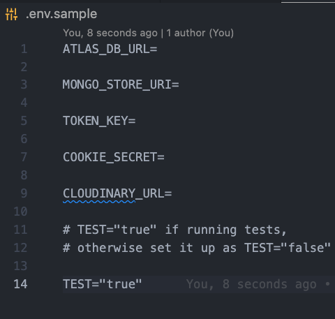
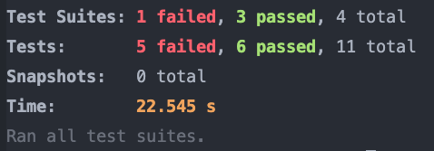
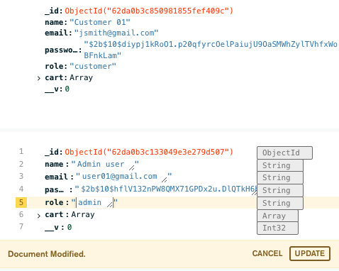
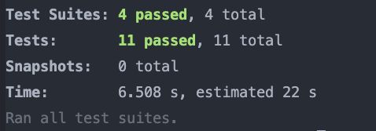

Full readme can be found here: https://github.com/desperate-housewares/app-readme

Backend can be found here: https://github.com/nik-mak/T3A2-B-Frontend
# Installation

To begin installing this app please clone the app into a folder from github. [link](https://github.com/desperate-housewares/dh-backend)

## Steps:

1. Open the terminal
2. CD into the dh-frontend-cra directory after cloning it as above. 
3. Type into the terminal 'npm install' and wait for it to complete the installation.
4. In the `.env` file add the required values.
5. Type into the terminal 'npm run dev' to start the application on your local machine.

### Create an Admin Account
To create an admin account, it will need to be done manually in the database. This is so that it's not possible to create a admin account in the browser. 

1. Open [MongoDB](https://www.mongodb.com/) and navigate to your database.
2. Locate the user you wish to grant admin access to.
3. Change the role of the user from `role: "customer"` to `role: "admin"`

Note: If you run into files not found when you have started the server but the components are present make sure that the directory name for the component matches the import statement. This should not effect your build if you deploy the website online using a platform such as netlify.

### Testing
1. Set up the .env file with TEST="true"

2. Start the server
3. Run npm test (5 tests should fail)

4. Go to MongoDB and change Admin user's role to role: "admin"

5. Restart the server

6. Run npm test (11 tests should pass)

# Dependencies

In this project the back end makes use of the following libraries:

1. [Express](https://github.com/expressjs/express)  
   Web framework for Node.js that provides simple features that made the development of this application more efficient.
2. [Dotenv](https://github.com/motdotla/dotenv)  
   This package is used to be able to safely store environment variables in a `.env` file and load them when required through the global object `process.env`.
3. [Multer](https://github.com/expressjs/multer)  
   A middleware responsible for handling the multipart/form-data, which is required in order to handle the data sent by the frontend forms with image upload.
4. [Cloudinary Node SDK](https://github.com/cloudinary/cloudinary_npm)  
   This Software Development Kit includes the necessary tools to integrate the server API with Cloudinary in order to upload and retrieve images.
5. [multer-storage-cloudinary](https://github.com/affanshahid/multer-storage-cloudinary)  
   This package provides an easy way to inform `multer` that the file should be stored in Cloudinary.   
6. [Express-session](https://github.com/expressjs/session)  
   A module used to create and manage session middleware for the Express app.  
7. [Connect-mongo](https://github.com/jdesboeufs/connect-mongo)  
   Module used to store Express sessions in MongoDB using a dedicated MongoDB connection.
8. [Mongoose](https://mongoosejs.com/)  
   Mongoose is an object modelling library for Node.js that enables schema-based models and validations to be implemented in our server API.
9. [CORS](https://github.com/expressjs/cors)  
   This Node.js middleware is used allow data to flow between the frontend and the backend by adding CORS (Cross-Origin Resource Sharing) support to the server and informing which origin is allowed to access the server.
10. [Jsonwebtoken](https://github.com/auth0/node-jsonwebtoken)  
   This package allows the implementation of JWT used for authentication and authorisation through the available `sign` and `verify` methods.
11. [Bcrypt](https://github.com/kelektiv/node.bcrypt.js)  
   Library used for password hashing so it can be stored and transmitted securely through the application.

# Project Management

Trello Board: [link](https://trello.com/invite/b/BzgS0oZt/641fd4be604d47fca55fb75d6d5855c0/team-project)

For our project we decided to allocate tasks based on the teams strengths. This lead to Gisele primarily working in the backend, Nik on both ends and Ben on the front end. In addition to this we all attended daily stand up (excl weekends) where we discussed what we were working on and the cards we would be trying to finish. Once assigned a card in our daily standup we would write  our checklist fo that card and input a dude date to track our progress.In addition to this you will notice that we limited our scope significantly so we could prioritize our MVP product. The difficulty levels on each card was also displayed on our Trello Board using labels. To see our daily progress look at our Trello Board where we logged daily screenshots of our Trello Board, our minutes and our stand ups. 

We did snapshot testing for some components on the frontend and unit testing and integration testing for components on the backed. In addition to this we also did user flow manual tests. These can be found here: [userFlowTests](https://docs.google.com/spreadsheets/d/1cAdR8FZKEPNZPPeULztCVAeeWFnUP69NutmQy8QTe40/edit?usp=sharing)

Lastly, for source control the team made use of git and git branches to organize the development of features for the app. A copy of our git-log can be found here: [commits](https://github.com/desperate-housewares/dh-backend/commits/main)
